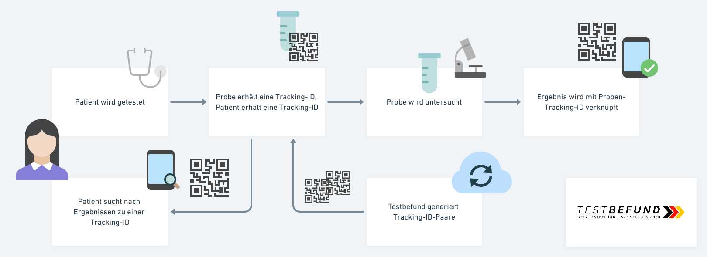

## Deine Testverfolgung -- Schnell & Sicher

Verfolge den Status deiner Probe whärend des gesamten Testzeitraums. Sobald das zuständige Labor das Testergebnis ermittelt hat, wird der mit deiner persönlichen Tracking-ID verknüpfte Status aktualisiert.

> Eine Tracking-ID verbleibt bei der getsteten Person, eine Tracking-ID begleitet die Probe.

## Verfolge jetzt deine Probe:

### Für Getetstete

Für getestete Personen beiten wir zwei Anwendungen:

#### Die Webanwendung [https://mein.testbefund.de](https://mein.testbefund.de)

Wenn du diese Webseite mit einem Gerät das über eine Kamera verfügt besuchst, kannst du deine Tracking-ID einscannen und den Test-status direkt ermitteln.

#### Die Android-App

Die Android-App für Getestete besitzt zusätzlich zur Webanwendung die folgenden Features:

- Es können mehrere Tracking-IDs hinterlegt werden - zum Beispiel für Familienmitglieder.
- Die Tracking-IDs können mit einem Namen versehen werden, um eine persönliche Zuordnung vorzunehmen.
- Die Tracking-IDs werden gespeichert und müssen nicht jederzeit erneut eingescannt werden.

[Zum Download](https://github.com/1-011-c/frontend-patient/releases)

### Für Labore

Für Labortechniker stellen wir eine optimierte Android-App bereit, die

- sich Interaktionslos, mit Handschuhen in einer klinischen Umgebung bedienen lässt.
- bei Aufheben/Ablegen des Gerätes automatisch den Scan-Modus aktiviert/deaktiviert.

[Zum Download](https://github.com/1-011-c/frontend-laboratory/releases)

### Für die Ausgabestelle der Tracking-IDs

Für die Ausgabestellen der Tracking-IDs gibt es eine Kommandozeilen-basierte Applikation, die

- die Tracking-ID-Paare generiert und online auf dem Server ablegt.
- die Tracking-ID-Paare druckfertig als PDF ablegt.

Die Tracking-ID-Paare können dann auf Kleberollen gedruckt und an die Testzentren und Ärzte verschickt werden.

[Zum Download](https://github.com/1-011-c/frontend-id-issuer/releases)

### Für Testzentren und Ärzte

Die Testzentren und Ärzte erhalten eine Tracking-ID-Rolle durch die Ausgabestelle und vorgedruckte Tracking-ID-Merkkarten. Nach Entnahme der Probe wird die Labor-ID auf das Begleitmaterial der PRobe aufgebracht und die PErsönliche Tracking-ID auf einer Merkkarte aufgebracht an die getestete Person ausgehändigt.

### Impressum

**Achtung!** Diese Webseite bewirbt einen Demonstrator der **keine** realen Daten verwendet und obwohl er voll funktionsfähig ist **keine** Testbefunde enthält!

Dieses Webseite ist Teil eines WirVsVirus-Hackathon Projektes "[011_Infektionsfall-Übermittlung_mein.testbefund.de][devpost]".

Der [Quellcode][project-meta] dieses Projektes ist mit der [MIT-Lizenz][license] lizensiert.

Diese Domain (und seine Subdomains, wie mein.testbefund.de) wird vorübergehend und ausschließlich Demonstrationszwecken durch die

mindkeeper solutions GmbH  
Am Stadtpark 3  
12167 Berlin

Geschäftsführer  
Florian Breisch  
Kerstin Hafemeister  

Registergericht  
Amtsgericht Charlottenburg  
Berlin  
HRB 164590 B

zur Verfügung gestellt. Mit Aufruf dieser Webseite werden Ihre öffentliche IP-Adresse sowie sonstige Informationen die Ihr Client überträgt, gemäß den [Richtlinien von GitHub][github-privacy] verarbeitet. Abfragen die der Auflösung des eingescannten QR-Code dienen werden durch die Amazon AWS verarbeitet und unterliegen deren [Datenschutzbestimmungen][aws-privacy]. Diese Webseite erhebt keine persönlichen Daten und nutzt kein Tracking.

[wirvsvirushackathon]: https://wirvsvirushackathon.org/
[mindkeeper-solutions]: https://mindkeeper.solutions
[devpost]: https://devpost.com/software/1_011_c_infektionsfall-ubermittlung
[project-meta]: https://github.com/1-011-c/meta
[github-privacy]: https://help.github.com/en/github/site-policy/github-privacy-statement#github-pages
[aws-privac]: https://aws.amazon.com/de/privacy/
[license]: http://opensource.org/licenses/mit-license.php
